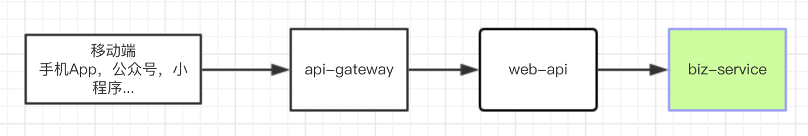

基于Dubbo的微服务基础框架，为前端提供的脚手架开发基础版本

项目定位：
>用于从大单体应用中解耦，实施前后端分离部署、分层部署、分服务部署，可使用独立数据库，应用redis缓存，发送MQ消息

###基础依赖
- JDK 8+
- zookeeper
- redis
- rabbitmq

###技术组件：
- spring boot 2
- dubbo-spring-boot-starter 2
- spring-boot-starter-data-redis
- mybatis-spring-boot-starter

###提供功能：
- 基于profiles提供的多环境打包构建
- 集成Log4j日志服务
- 集成redis
- 集成mybatis
- 集成mybatis-generator，快速上手数据库业务开发
- 集成rabbitmq，将消息处理从业务应用中解耦